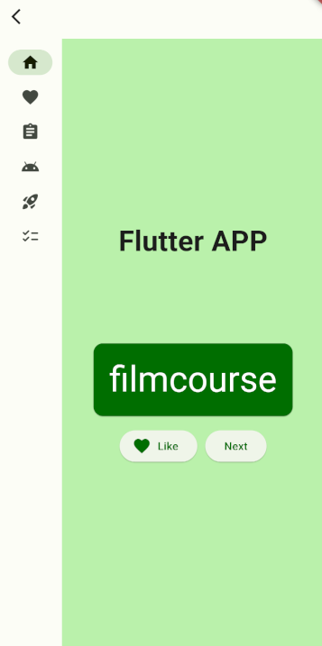

Este projeto de exemplo consiste na integração de um Módulo Flutter dentro do React Native. Tudo para fins de validação e pesquisa.

Aqui no <b>README</b> temos uma documentação técnica, com o propósito de auxiliar na execução.


### Previsualizando o projeto rodando

Abaixo temos um .gif da <b>integração em funcionamento</b>

<!--  -->


Abaixo temos duas imagens referentes a <b>integração em funcionamento</b>. A esquerda temos a tela em React Native, e a direita a tela em Flutter.



<!--  -->

### <b>Documentação</b> mais abrangente

Para saber mais detalhadas sobre a integração, como as tecnologias usadas, possíveis problemas e a parte teórica, <b>consulte o documento de dossiê no SharePoint</b>. [Este é o link para o documento!](https://seniorsistemassa.sharepoint.com/:w:/s/ResearchTeam/EXjYbnuCmWhArvU5_eeaBKsBE3XhEbGEZYS-GuLtovvq7A?e=HvYTdC)

## 1. Preparando ambiente da máquina

Caso você não tenha instalado as ferramentas e configurações descritas abaixo, será necessários instalar e/ou configura-las.

<b><i> Deve-se ter instalado na máquina as seguintes ferramentas: </i></b>

1. Android Studio
    * Utilizamos a versão Giraffe 2022.3.1
2. Qualquer IDE para ambas tecnologias
    * Utilizamos o VS CODE com as extensões Dart e Flutter, para o Flutter
    * Utilizamos o VS CODE para o React Native

<b><i> Também é necessário que você tenha as seguintes configurações: </i></b>

1. Emulador no Android Studio & configurações do React Native
    * É possível seguir [esta documentação oficial](https://reactnative.dev/docs/environment-setup)
2. Configurações do Flutter
    * É possível seguir [esta documentação oficial](https://docs.flutter.dev/get-started/install)

## 2. Preparando ambiente do módulo Flutter

<ins><i> Instale as dependências no módulo Flutter </i></ins>

```
cd rn_flutter_sdk
```

```
flutter pub get
```

<ins><i> Agora crie o build AAR do módulo Flutter </i></ins>

```
flutter build aar
```

<ins><i> Caso, deseje testar somente a tela do módulo flutter, execute o emulador android e em seguida rode: </i></ins>

```
flutter run
```

### 3. Preparando ambiente do React Native

<ins><i> Instale as dependências na raíz do projeto </i></ins>

```
cd ..
```

<i><b>Obs:</b> Rode apenas um dos comandos abaixo, após definir se irá utilizar <ins>yarn</ins> ou <ins>npm</ins> como gerenciador de pacotes</i>

```
yarn
```
```
npm i
```

<ins><i> Instale as dependências no projeto de exemplo </i></ins>

```
cd example
```

<i><b>Obs:</b> Rode apenas um dos comandos abaixo, após definir se irá utilizar <ins>yarn</ins> ou <ins>npm</ins> como gerenciador de pacotes</i>

```
yarn
```
```
npm i
```

<ins><i> Para executarmos a tela de integração, basta rodarmos o seguinte comando: </i></ins>

```
yarn android
```
```
npm run android
```

## Gerar APK de APP

```
cd example
```

```
react-native build-android --mode=release --tasks clean, assembleRelease
```


## [GIT] Commits

```
git add .
```

ou

```
git add --all
```

<ins><i> Para fazer commits utilize um dos comandos abaixo (necessário devido ao commitlint) </i></ins>

```
git commit -n -m "<sua-mensagem>"
```
```
git commit --no-verify -m "<sua-mensagem>"
```

Em seguida utilize o:

```
git push
```

## 📄 Algumas referências importantes que usamos no decorrer da integração

- **[Medium: Flutter Integration with React Native](https://kps250.medium.com/flutter-integration-with-react-native-e796fc42556f) por Kiran Shinde.**;
- **[React Native: Integration with Existing Apps](https://reactnative.dev/docs/integration-with-existing-apps)**;
- **[Flutter: Integrate a Flutter module into your Android project](https://docs.flutter.dev/add-to-app/android/project-setup)**;
- **[Flutter: Integrate a Flutter module into your iOS project](https://docs.flutter.dev/add-to-app/ios/project-setup)**;
